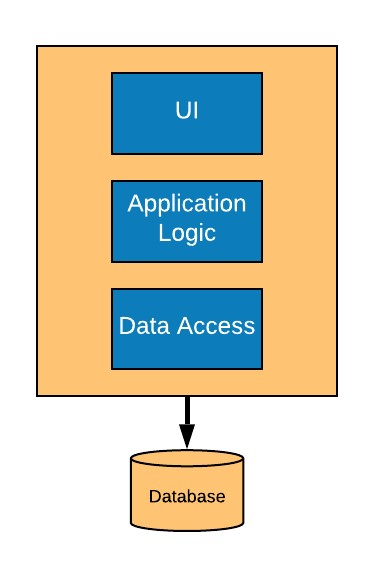
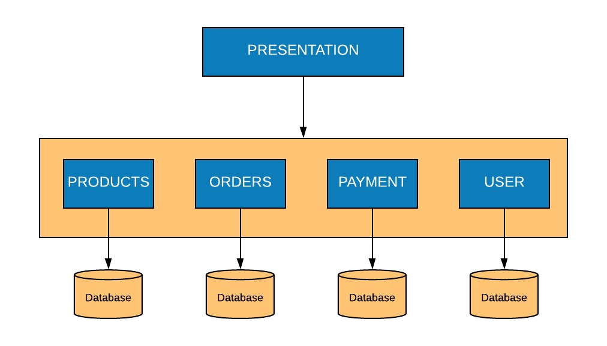
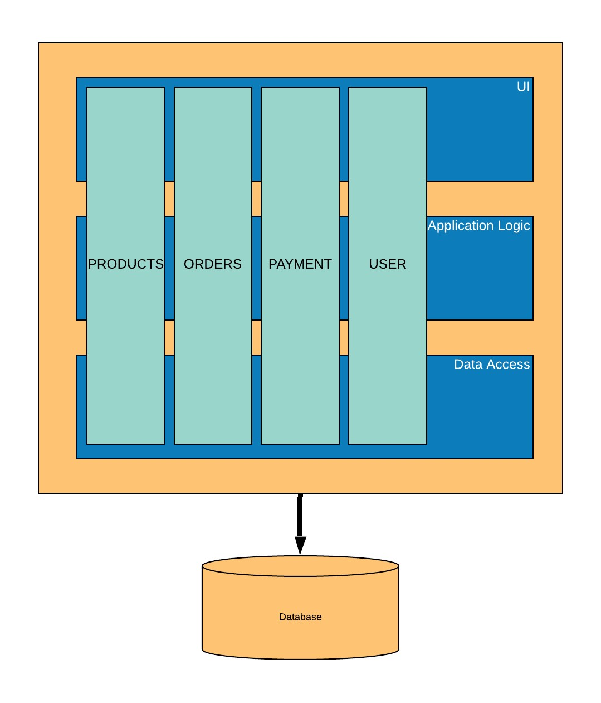
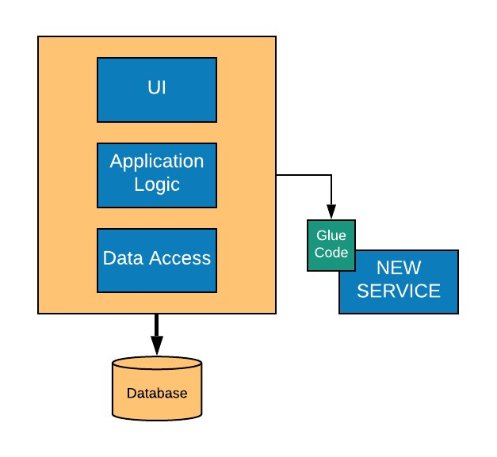
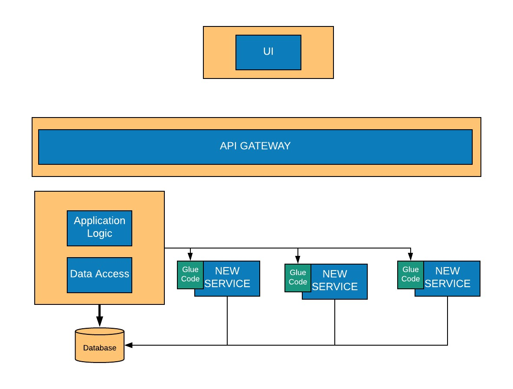

# Monoliths to Microservices using DDD

## The Journey
  *"So, you want to build a three-masted schooner. Step One: before assembly, take inventory of all parts."  (Niles Crane – An Affair to Forgot 2.22)*

A monolithic application is typically an application system in which all the relevant modules are packaged together as a single deployable unit of execution. These applications can be a Java Web Application (WAR) running on Tomcat or an ASP.Net MVC Application running on IIS, fig1.

These systems start small and tend to have grown over time to meet business needs. Features are added organically to meet rising user demand. However, at some point, the system reaches an inflection point. The monolith application begins to suffer from the following symptoms:
- Tight coupling of the system means it is no longer possible to isolate aspects of the system to scale them independently, 
- Code maintenance becomes an issue due to tight coupling and hidden dependencies
- Testing becomes harder increasing the probability of introducing vulnerabilities. 

Large monolithic applications can become an obstacle to future growth and stability.  Teams become wary of making changes as the original cohort of developers may no longer be with the company and documentation may be sparse and so great care is taken when making modifications to the application.

However, this does not imply that all monolithic applications are bad. In early phases of development, monoliths tend to be:
- Easier to build
- Easier to debug
    - Everything is running within a single process and memory space
- More accessible to reason about the system 
- Easier to prove a concept 

There comes the point in the application’s lifecycle that it no longer provides the same benefits as before and so the application is entirely re-written from scratch or modernised and migrated to a new architectural style that can accommodate change, such as microservices.

Migrating a monolith to a microservice, is, unfortunately, a non-trivial task. It requires significant time and investment to ensure that migration is successful and not fraught with failure and overruns. To ensure that any migration is successful, it is good to gain an understanding of microservices and the benefits (and challenges) they bring. The term microservices, or the concept, was first introduced by Dr Peter Rogers in 2005 on Cloud Computing, the term used, at the time was  [“Micro web services” ](https://www.mdpi.com/2076-3417/8/8/1368). The term microservices appeared in 2011 as an architectural style that pioneers were experimenting at the time. The term was coined at an architectural conference near Venice in 2011; one of the early and well-known pioneers is Netflix.

Unlike monoliths, microservices are typically decentralised loosely coupled units of execution; in other words, an application is composed of a series of microservices – fig 2. 
 

Microservices tend to favour standard protocols such as HTTP and implementations can be based upon the REST architectural style, which allows for communication through language independent APIs. Other microservices can be implemented in an asynchronous manner using queues. Or, they can be a combination of both. 

Microservices, when done right can provide significant benefits:
-	Introduce greater agility
-	Services can evolve independently based on user needs
-	Services can scale independently to meet user demand
-	Over time, development cycles become faster as features can be released to market quicker
-	Services are isolated and are more tolerant of failure
    -	A single service that fails will not bring down the entire application
-	Ttesting becomes more coherent and consistent 
    -	Behavioral Driven Develpement (BDD) tests can be used to test each microservice independently of other services

However, loosely coupled architectures can also cause problems:
- Communication becomes a problem; you are no longer bound to a single process and memory space; 
- More tools are needed to manage the lifecycle of the microservice; 
- Teams need to change their behaviours and increase collaboration in an agile manner with a mature DevOps Culture. 
- The surface area for vulnerability increases exponentially 
- Debugging tends to be harder due to different process
- Test suites can be more complicated, and new automated testing styles may be required such as BDD
- Orchestration can be more involved due to the increase of independent services

When implemented correctly, the operational and developmental benefits that microservices bring, far outweigh any negatives. Most software systems have a finite shelf life, at which point, the application is improved or re-written. Microservices naturally lend themselves to the agile software development paradigm and allow for rapid development and refocusing in an ever changing business environment. 

The naturally de-coupled nature of microservices allows them to be more fault tolerant and when using with an orchestration system like Kuberenetes, allows for a microservices based application to be highly fault tolerant and available.

Given the high-level overview of both architectures. When a monolith reaches the critical inflexion point, the point at which an addition of a new feature brings complexities and issues. It is at this point a strategy needs to be in place which allows a monolithic application to be decomposed into its constituent parts and re-purposed as a set of microservices. 

This is one of the major factors that stop teams from modernisation due to the fear of impacting the legacy system.

Any migration strategy should allow teams to incrementally refactor the application into smaller services, while still providing continuity of service to end users. [The Strangler Pattern ](https://martinfowler.com/bliki/StranglerFigApplication.html) defined by Martin Fowler defines such a strategy, which allows for a controlled decomposition of a monolith into a set of microservices, over a period, the microservices will cause the monolith to shrink in size and complexity, to the point it no longer exists.

The following strategies can be then used to implement this
- Stop adding functionality to the monolith
- Split the front end from the backend
- Decompose and decouple the monolith into a series of microservices

To help facilitate this decomposition, a viable software development approach is to apply the principles of domain-driven design (DDD). 

Domain Driven Design (DDD) is a software development approach, [ first introduced by Eric Evans in 2003](http://domainlanguage.com/ddd/) . DDD is an approach  where one must have a good understanding of the domain for which the application will be written. The necessary domain knowledge to create the application resides within the people who understand it – the domain experts. 

There are many terms that DDD use that help facilitate this, one such example is called “ubiquitous language.” It ensures that there is common vocabulary between all stakeholders. For example: When you use a pen, you know what it can and cannot do and know the boundaries that apply to it, you can ask different subject matter experts for a pen, and they will also understand what a pen is, without relying on you to interpret it for them.

Once you have identified a shared common vocabulary that the entire team (dev; product owners) can use, the next step is to identify the relevant modules in the monolithic application and apply their common vocabulary to them, which help define the models of the monolithic application.

Bounded Contexts further enhance the models by applying explicit boundaries with clearly defined models and responsibilities fig 3.

These bounded contexts are potentially viable candidates for refactoring into smaller microservices.

While this investigate work is carried out to inventory the monolithic application, new functionality can be added by applying the principles of DDD as separate services with “glue code” which allows the monolithic application to proxy calls to the new service to obtain new functionality fig 4

The  [glue code (adapter pattern)](https://en.wikipedia.org/wiki/Glue_code) effectively acts as an anti-corruption layer, to ensure that the new service is not polluted by data models required by the monolithic application; the glue code helps to mediate interactions between the two and ensures that only data that is required by the new service is passed to enable compatability between the services. 

Through the process of refactoring, teams can inventory the monolithic application and identify candidates for microservices refactoring while also establishing new functionality with new services.

The next step in the process of refactoring the monolithic is to separate the presentation layer from the back-end layer. In a traditional n-tier application, the application (business) layer tend to be the components that are core to the application and have domain logic within them. These coarse-grained APIs interact with the data access layer to retrieve persisted data from within a database. These APIs establish a natural boundary to the presentation tier and helps facilitate decoupling of the presentation tier into a separate application space fig 5.

In figure 5, another layer has been introduced. This façade layer (API Gateway) helps to provide a consistent and uniform interface for the UI layer to interact with, while allowing downstream services to evolve independently, without affecting the application. The API Gateway, such as [Azure API Management](https://azure.microsoft.com/en-gb/services/api-management/) allows the application to interact in a RESTful manner.

The presentation tier can be developed in language or framework that the team has expertise in, such as a single page application, or an MVC application. These applications then interact with the microservices using standard HTTP calls.

At this stage, the team can begin “peeling away” the monolithic application and slowly extract the services that have been established by their bounded contexts into their own set of microservices. The microservices can expose a RESTful interface for the application layer to interact with, through the API layer and have glue code in place to communicate with the monolith in specific circumstances figure 6.

As you continue to peel away the monolith, eventually there will come the point in which it no longer needs to exist, the microservices have been successfully extracted from the monolith. At this point, the mediation, or anti-corruption layer can be safely removed fig 7. 

Finally, when the application has been decomposed into constituent microservices, it then becomes possible to leverage modern orchestration toolssuch as [Azure Devops](https://azure.microsoft.com/en-gb/services/devops/) to manage the lifecycle in of the application from development through to production. 

These Microservices can be deployed into Azure and leverage [Azure App Services](https://azure.microsoft.com/en-gb/services/app-service/) for running these services in the cloud coupled At [PI Managemen](https://azure.microsoft.com/en-gb/services/api-management/) acting as the facade to allow for [fine grained control of each of the services](https://azure.microsoft.com/en-us/blog/benefits-of-using-azure-api-management-with-microservices/ ).

